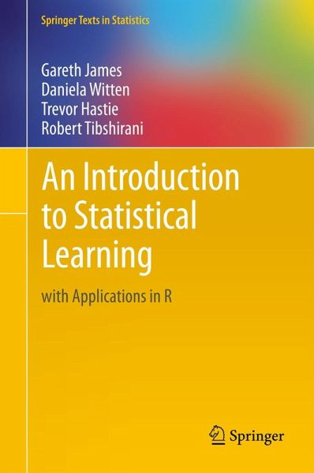

# Statistical Learning Part 2

**organised by [Vancouver School of AI](https://www.facebook.com/groups/991378534367193/)**

**Date: 23 October 2018**

## Installation Requirements

Instead of working in R, as in the book, we will do the applications in Python.

It is recommended that you use either [Google Colab](https://colab.research.google.com/notebooks/welcome.ipynb#recent=true) or [Jupyter Notebook](http://jupyter.org/).

## Meetup Content

[Statistical Learning Part 2](https://docs.google.com/presentation/d/1hdb-CT2LkbaZJHRNhsmYLsFJXHL7DKF5Pvq61j6o_sA/edit?usp=sharing)

[Introduction to Data Science Tools](https://github.com/johannesgiorgis/school_of_ai_vancouver)

## Resources

The meetup covers Chapter 3 and 4 from the book, *An Introduction to Statistical Learning*. The book can be downloaded [here](http://www-bcf.usc.edu/~gareth/ISL/ISLR%20Seventh%20Printing.pdf), but has been added to this repo, [here](https://github.com/SchoolofAI-Vancouver/statistical_learning_1/blob/master/docs/An%20Introduction%20to%20Statistical%20Learning%20-%20Gareth%20James.pdf), for convenience.

The book gives R application code snippets. However, we will be working in Python. The Python code snippets for the book can be found [here](https://github.com/JWarmenhoven/ISLR-python).

## Code Challenge

**Due Date:** Sunday, 4 November @ midnight (PST)

**Challenge:** Build a linear regression or classification model of your choice! Use the techniques of the covered chapters to validate your model accuracy. Check out the book exercises for inspiration (Python code snippets for [Chapter 3](http://nbviewer.jupyter.org/github/JWarmenhoven/ISL-python/blob/master/Notebooks/Chapter%203.ipynb) and [Chapter 4](http://nbviewer.jupyter.org/github/JWarmenhoven/ISL-python/blob/master/Notebooks/Chapter%204.ipynb) exercises).

**Everyone is encouraged to participate!**

The winning submission should ideally contain:

* an interesting model application
* a reasonably accurate model
* documentation explaining your process

To submit, post your submission's repository link on the `# coding_challenge` Slack channel (on the Vancouver School of AI workspace) before the due date.

## Meetup Contributors

[Akshi Chaudhary](https://github.com/akshi8)

[Johannes Giorgis](https://github.com/johannesgiorgis)

[Johannes Harmse](https://github.com/johannesharmse)

[Peter Lin](https://github.com/peter0083)

[Xinbin Huang](https://github.com/xinbinhuang)

